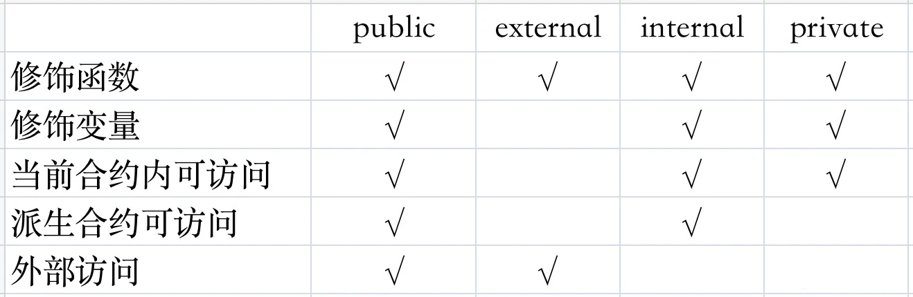

# 代码结构

## 1、一个合约

```solidity
//SPDX-License-Identifier: MIT
pragma solidity >=0.8.0;

// 定义一个合约
contract Counter {
    uint public counter;
    
    constructor() {
        counter = 0;
    }
    
    function count() public {
        counter = counter + 1;
    }
    
    function get() public view returns (uint) {
        return counter;
    }
}
```

## 2、声明版本

```solidity
pragma solidity >=0.8.0;

pragma solidity >=0.8.0 <0.9.0;

pragma solidity ^0.8.0;
```

- `>=0.8.0`：允许任何 **0.8.0** 及以上版本，不限制上限。
  - 这个声明表示编译器的版本必须是 **0.8.0** 或更高版本，但没有上限。这意味着它会支持所有 **0.8.x** 版本以及更高版本的编译器，但可能存在不兼容的变化。推荐用于需要灵活性的情况，允许随着时间推移的版本更新。
- `>=0.8.0 <0.9.0`：仅允许 **0.8.x** 版本范围，不允许 **0.9.0** 或更高版本。
  - 这个声明表示编译器版本必须是 **0.8.0** 或更高版本，但不允许使用 **0.9.0** 或更高版本。它确保在 **0.8.x** 的范围内，避免了未来版本（如 **0.9.0**）中的不兼容变化。这样做能确保代码与 **0.8.x** 系列版本兼容，并避免出现可能破坏代码的向后不兼容改动。
- `^0.8.0`：允许 **0.8.x** 版本范围，但不允许升级到 **0.9.0** 或更高版本。
  - 这个声明表示编译器版本必须是 **0.8.0** 或更高版本，但会在 **0.8.x** 范围内（不包括 **0.9.0**）。它的意思是“兼容 **0.8.x** 版本中的所有更新，但不兼容任何 **0.9.x** 或更高版本”。这相当于限制为 **0.8.0** 及其更新版本，但不会自动接受未来的重大版本更新。

## 3、定义合约

```solidity
contract Counter {
		//...
}
```

这样定义一个合约，和 java 定义一个 class 一样。

## 4、构造函数

```solidity
pragma solidity >=0.7.0;

contract Counter {
    uint x;
    address owner;
    constructor(uint _x) public {
       x = _x;
       owner = msg.sender;
    }
}
```

例如上面的一个合约，构造方法就是 constructor(uint _x) public，和面向对象编程一样。

## 5、实例函数

```solidity

// ...

contract Counter {
    uint public counter;
    
    function count(uint x) public {
        counter = counter + x;
    }
}
```

对于实例方式而言：

1. function: 声明一个函数
2. count: 函数名字
3. uint x: 参数表，类型、形参
4. public: 这个表示方法的修饰，表示可见性

```solidity
function 函数名(<参数类型> <参数名>) <可见性> <状态可变性> [returns(<返回类型>)]{ 

}
```

下面的表，表示各个修饰词的范围：



## 6、常量 & 变量

```solidity
contract Example {
		uint public counter;								// 变量
    string constant text = "abc";				// 常量
    uint immutable maxBalance;					// 不可变量
}
```

- uint public counter; 这行代码声明了一个变量，变量名为counter，类型为[uint](https://decert.me/tutorial/solidity/solidity-basic/int)（一个256位的无符号整数），它是可以被公开访问的。定义变量按格式：`变量类型` `变量可见性` `变量名`。变量可见性是可选的，没有显示申明可见性时，会使用缺省值`internal`。
- 使用`constant`修饰的状态变量，只能使用在编译时有确定值的表达式来给变量赋值。
- 使用 `immutable` 来定义一个不可变量，`immutable`不可变量同样不会占用状态变量存储空间，在部署时，变量的值会被追加的运行时字节码中，因此它比使用状态变量便宜的多，同样带来了更多的安全性（确保了这个值无法再修改）。

