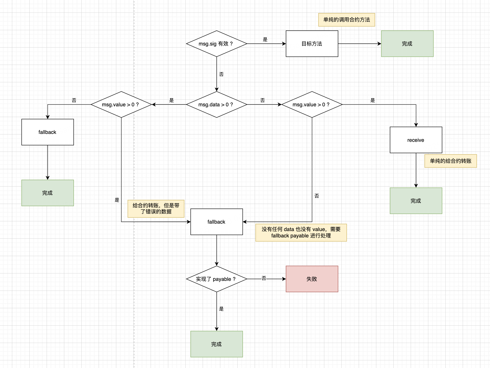

# msg.data

`msg.data` 是 Solidity 交易（transaction）中包含的 **原始 calldata**，用于存储交易附带的数据。它在合约函数调用时被自动传递，主要用于识别调用的函数和参数。

## 1、主要特点

- `msg.data` **包含交易中的完整输入数据（calldata）**，包括函数选择器（selector）和参数。
- `msg.data` **是 `bytes` 类型**，可以在 Solidity 合约中读取。
- `msg.data` 的作用主要是：
  - 确定调用的函数（函数选择器）。
  - 传递函数参数。
  - 在 `fallback` 或 `receive` 逻辑中检测是否有数据。

## 2、结构

**当调用合约函数时，`msg.data` 由以下部分组成：**

| 字节范围    | 内容       | 说明                   |
| ----------- | ---------- | ---------------------- |
| 0x00 - 0x03 | 函数选择器 | 4 字节，代表调用的函数 |
| 0x04 - ...  | 参数数据   | 按 ABI 编码的参数      |

### **示例**

假设我们有一个合约：

```solidity
contract Example {
    function foo(uint256 x) public pure returns (uint256) {
        return x + 1;
    }
}
```

调用：

```solidity
example.foo(42);
```

生成的 `msg.data`：

```
0x2c4e5b3d000000000000000000000000000000000000000000000000000000000000002a
```

- `0x2c4e5b3d` 是 **函数选择器**（`keccak256("foo(uint256)")` 的前 4 字节）。
- `0x0000...002a` 是 **参数数据**（42 的 ABI 编码）。

------

## 3、在 `fallback` 和 `receive` 中的作用

### （1）用于 `fallback` 处理未知调用

如果交易调用了**合约中不存在的函数**，或者交易带有 `msg.data` 而没有 `receive()`，则 `fallback()` 会被触发：

```solidity
contract FallbackExample {
    event FallbackCalled(address sender, uint amount, bytes data);

    fallback() external payable {
        emit FallbackCalled(msg.sender, msg.value, msg.data);
    }
}
```

当调用不存在的 `foo()` 时：

```solidity
contractInstance.foo(42);
```

触发 `fallback()`，并记录 `msg.data`：

```
Fallback called! data: 0x2c4e5b3d000000000000000000000000000000000000000000000000000000000000002a
```

------

### （2）用于区分 `receive` 和 `fallback`

| 情况              | `receive()` 存在 | `fallback()` `payable` 存在 | 触发函数                    |
| ----------------- | ---------------- | --------------------------- | --------------------------- |
| `msg.data` 为空   | ✅ 触发 `receive` | ✅ 触发 `fallback`           | `receive()` 或 `fallback()` |
| `msg.data` 不为空 | ❌ 没有 `receive` | ✅ 触发 `fallback`           | `fallback()`                |

示例：

```solidity
contract Example {
    receive() external payable { }
    fallback() external payable { }
}
```

- **如果 `msg.data` 为空**（纯 ETH 转账），触发 `receive()`。
- **如果 `msg.data` 不为空**（函数调用或带数据的转账），触发 `fallback()`。

------

## 4、 使用 `msg.data` 进行合约代理

代理合约（Proxy）使用 `fallback` 通过 `delegatecall` 将 `msg.data` 直接转发到目标合约：

```solidity
contract Proxy {
    address public implementation;

    constructor(address _impl) {
        implementation = _impl;
    }

    fallback() external payable {
        (bool success, ) = implementation.delegatecall(msg.data);
        require(success, "Delegatecall failed");
    }
}
```

✅ 任何调用都会转发到 `implementation`，并带上原始 `msg.data`。

------

## 5、相关的内置变量

| 变量         | 说明                                         |
| ------------ | -------------------------------------------- |
| `msg.sender` | 交易发送者的地址                             |
| `msg.value`  | 交易发送的 ETH 价值                          |
| `msg.data`   | 交易的原始 calldata                          |
| `msg.sig`    | 交易中的函数选择器（`msg.data` 的前 4 字节） |

### 提取 `msg.sig`

```solidity
contract MsgDataExample {
    function getSelector() public pure returns (bytes4) {
        return msg.sig;
    }
}
```

✅ **如果调用 `getSelector()`**，返回的 `msg.sig` 就是：

```
0xc6888fa1
```

（对应 `keccak256("getSelector()")` 的前 4 字节）

## 6、总结

- `msg.data` 是合约调用时传递的 **完整 calldata**，包括函数选择器和参数。
- `msg.data` **为空时**，`receive()` 会处理 ETH 交易。
- `msg.data` **不为空时**，会触发 `fallback()`（如果 `fallback` 存在）。
- 在代理合约（Proxy）中，`msg.data` 允许**转发原始调用**，保持调用透明性。

### 7、交易处理表

1. `msg.data` 为空，也就是没有函数选择器也没有参数的时候，就会触发 `receive()` 会处理 ETH 交易。
2. 如果 `msg.data` 不为空时，会触发 `fallback` 函数。
3. 没有函数选择器或者函数选择器错误的时候，会触发 `fallback` 函数。如果附带有 ETH，那么要看 fallback 是否带有 payable，如果有那么就会成功。




| **情况**                                 | **是否有转账（msg.value > 0）** | **是否带有正确的函数选择器（msg.sig 有效）** | **是否带有数据（msg.data 长度 > 0）** | **触发的函数**                        | **交易行为**                               |
| ---------------------------------------- | ------------------------------- | -------------------------------------------- | ------------------------------------- | ------------------------------------- | ------------------------------------------ |
| **1. 纯 ETH 转账=                        |                                 |                                              |                                       | `receive()`（若存在） 或 `fallback()` | 直接发送 ETH，`msg.data` 为空              |
| **2. ETH + 正确函数调用                  |                                 |                                              |                                       |                                       |                                            |
| **3. ETH + 错误数据（无函数选择器）**    | ✅ 是                            | ❌ 否                                         | ✅ 是                                  | `fallback()`（若 `payable`）          | 交易附带 ETH，但 `msg.data` 不是函数选择器 |
| **4. ETH + 错误函数选择器**              | ✅ 是                            | ❌ 否（但 4 字节）                            | ✅ 是                                  | `fallback()`（若 `payable`）          | 交易带 ETH，`msg.sig` 不匹配任何函数       |
| **5. 纯数据调用（无 ETH）**              | ❌ 否                            | ❌ 否                                         | ✅ 是                                  | `fallback()`                          | 交易不包含 ETH，仅 `msg.data`              |
| **6. 正确的函数调用（无 ETH）            |                                 |                                              |                                       |                                       | 仅调用函数，无 ETH 交易                    |
| **7. 无 ETH + 错误数据（无函数选择器）** | ❌ 否                            | ❌ 否                                         | ✅ 是                                  | `fallback()`                          | 交易带 `msg.data`，但格式无效              |
| **8. 无 ETH + 纯转账（无数据）           |                                 |                                              |                                       | fallback()`                           | 交易不包含 ETH，也没有 `msg.data`          |

